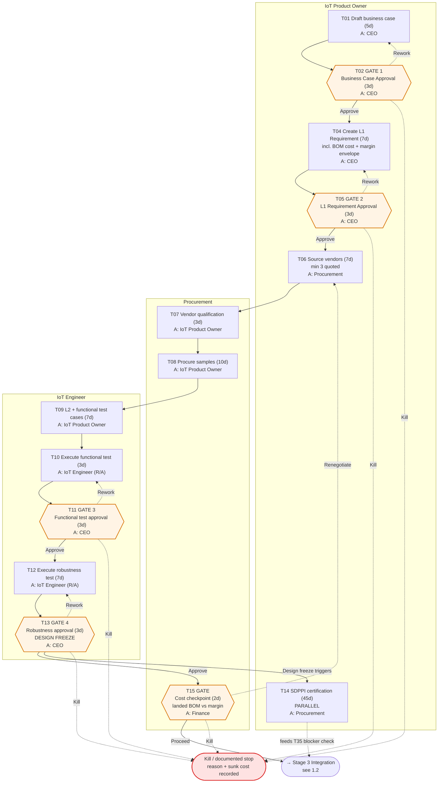
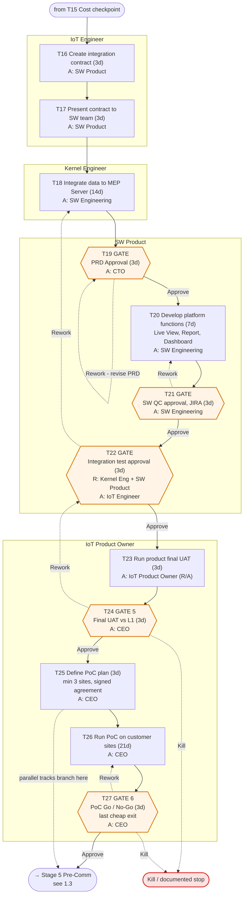
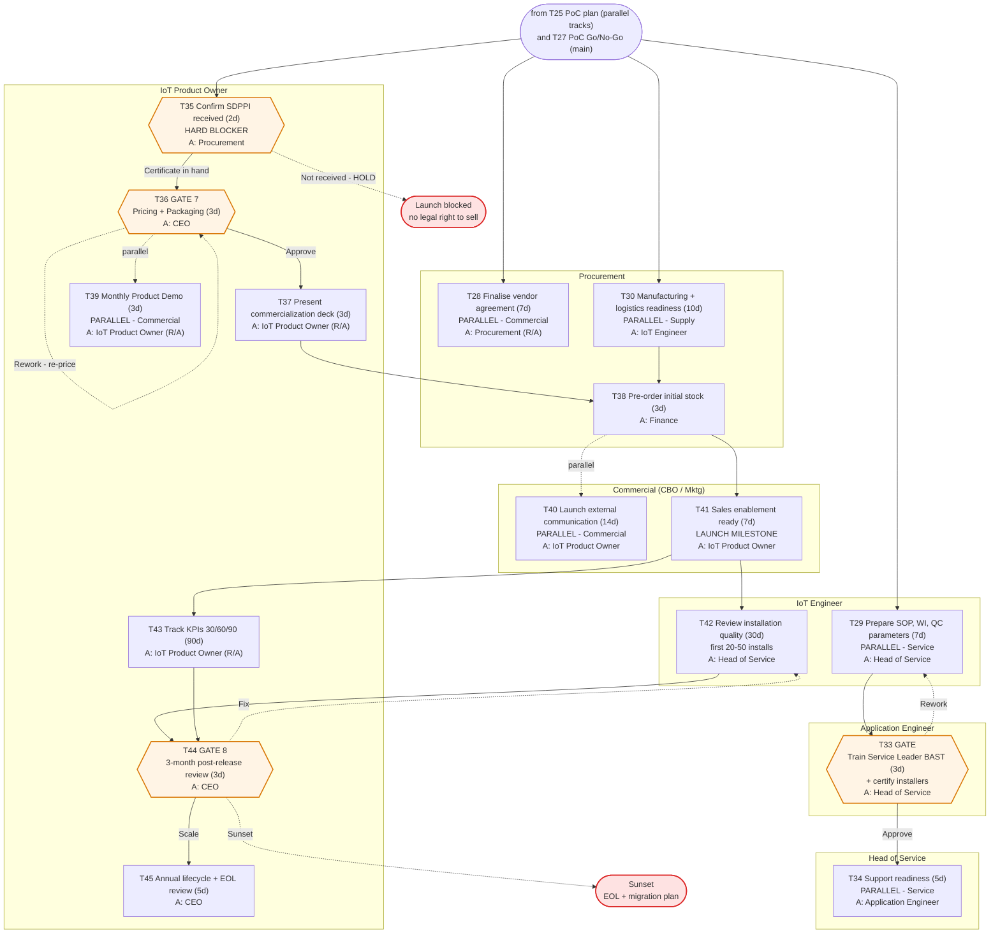
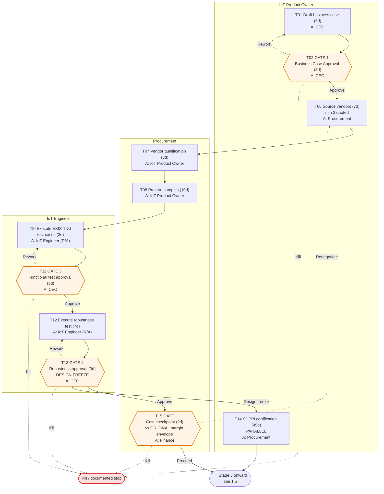
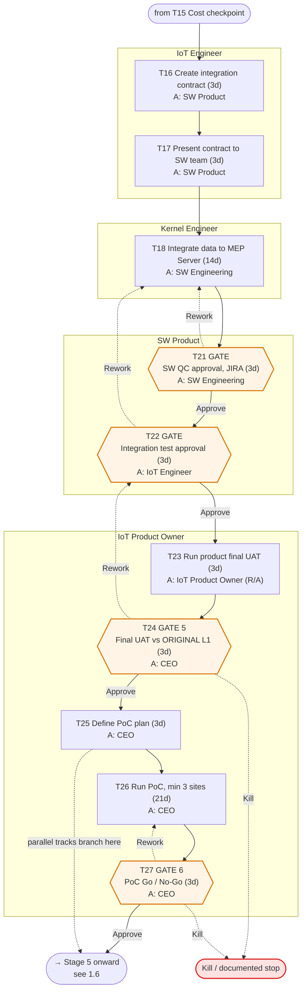
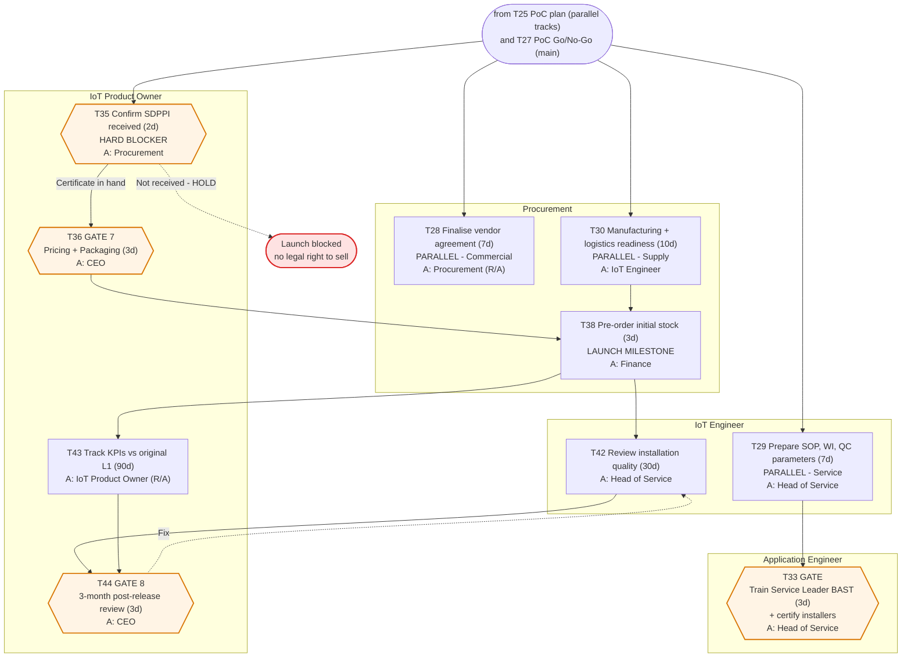
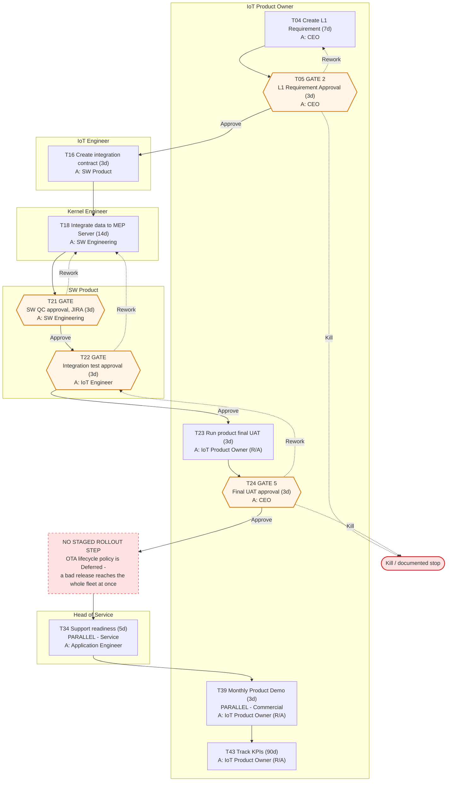
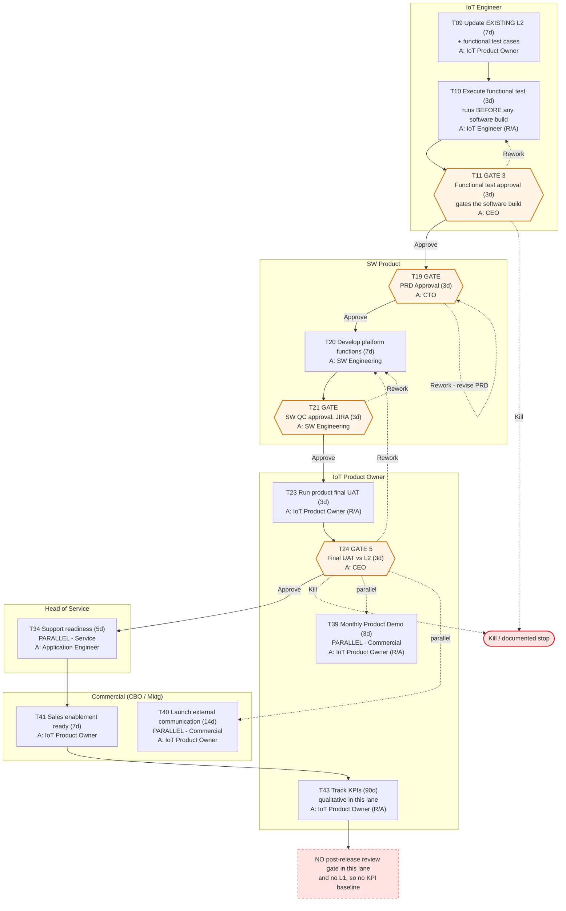

# 1. Swimlane Flowcharts — HW IoT Product Development

Source: `IoT BP V3.6.xlsx`, Master Matrix. Regenerate from `extract/matrix.json` when the workbook version changes.

## How to read these

- **Each swimlane column is a role** — specifically the **Responsible (R)** role, the one that does the work. Flow runs top to bottom.
- The **Accountable (A)** role — the one that signs and owns the outcome — is printed inside the node as `A: <role>`.
- **Gates** are hexagonal `{{ }}` nodes. Every gate has three outcomes, and all three are drawn:
  - solid edge forward = **Approve**
  - dashed edge backward = **Rework**, which returns to a named prior task with a written defect list
  - dashed edge to the red terminal = **Kill**
- Kill is drawn as a real path on purpose. The governance rules state that killing early is the point of gates and is a success outcome, not a failure. A diagram that only shows the happy path teaches the opposite.
- Duration in working days is shown as `(5d)`.
- Deferred tasks (T31 warranty/RMA, T32 OTA lifecycle) are not drawn — they are `Status = Deferred` in the workbook. See deliverable 3.

**Diagram sizing.** Each diagram is split so it renders legibly in a standard Confluence content column (roughly 1,300–2,000 px wide). Long lanes are split by stage rather than compressed into one unreadable chart. Every task in a lane appears exactly once across that lane's diagrams.

**Confluence:** paste each fenced block into a Mermaid macro. See `README.md`.

---

## 1.1 Full NPD — Stage 0 to Stage 2 (Opportunity → Design Freeze → Cost Checkpoint)

New hardware platform, new product category, or first engagement with an unproven vendor. This section runs T01–T15 and ends at the landed-cost kill trigger — the last cheap exit before integration spend starts.

**Two things this diagram is meant to make obvious:**

1. **T14 certification branches at design freeze, not later.** SDPPI/Postel is 45 days of fixed external queue time that cannot be compressed by adding people. It cannot start before T13, because certification covers a specific frozen hardware configuration — any change means re-certifying. T13 is therefore the earliest safe start, and starting it there keeps it off the critical path.
2. **T15 sits before Stage 3, not inside it.** Integration is the most expensive phase (Kernel Engineer + SW Engineering + SW Product all engaged). Testing the economics at ~day 63 instead of ~day 150 is the entire reason this task exists.

---

## 1.2 Full NPD — Stage 3 & 4 (Integration → PoC)

**T27 is the last cheap exit.** Everything after it involves stock commitment, executed contracts and public announcements.

---

## 1.3 Full NPD — Stage 5 to Stage 7 (Pre-Comm → Post-Comm)

The three parallel tracks (Commercial, Service, Supply) branch from T25 and run alongside the PoC, which is why they appear here with start points earlier than the main chain.

**Note on T35.** This is not a normal gate — it is a blocker check with no rework path. Either the certificate is in hand or the product cannot legally be sold. If T14 slipped, this is where you find out, and by then stock is about to be ordered and installers are already trained. That is the failure mode the early-certification move was designed to prevent.

---

## 1.4 New Vendor / HW Upgrade — Stage 0 to Stage 2

Existing category, new supplier or revised hardware revision. **Reuses the original L1 and L2 and their test cases** — no new requirement authoring (T04, T05, T09 are absent). Keeps certification, vendor qualification and the full test execution, because a different supplier's hardware is genuinely unproven even in a known category.

31 tasks in total, 146 critical-path days.

---

## 1.5 New Vendor / HW Upgrade — Stage 3 & 4 (Integration → PoC)

---

## 1.6 New Vendor / HW Upgrade — Stage 5 to Stage 7

**Note.** There is no T19 PRD gate and no T20 platform development in this lane — a vendor swap should not require new platform features. If a proposed HW upgrade *does* require them, the change spans two lanes and the routing rule says take the heavier lane: run Full NPD. Also absent: T34 support readiness, T37, T39, T40, T41, T45.

**Worth questioning:** T34 (support readiness) is absent from this lane, yet a new supplier's hardware may fail in ways the existing support runbook does not cover.

---

## 1.7 FW Upgrade lane

Firmware change to devices already in the field. Needs an L1 requirement and CEO sign-off, then integration and acceptance. No L2 authoring, no procurement, no certification.

11 tasks, 39 critical-path days.

**The gap is drawn deliberately.** T32 (OTA / firmware lifecycle policy — versioning, 5%/25%/100% staged rollout, rollback procedure, fleet FW compliance tracking) is marked `Deferred` in the workbook, and this is the one lane where that deferral has teeth. A firmware release currently goes from CEO UAT approval straight to the whole installed base with no rollback procedure. This is the highest-severity known gap in the process and worth closing before the first at-scale OTA.

---

## 1.8 New SW Feature lane

Platform-side feature on existing hardware. Starts at L2, and — unusually — **the HW team runs functional testing first**. Only once the CEO approves that result does SW Product write the PRD and start the build.

13 tasks, 39 critical-path days.

**The ordering here is the point of the lane.** T11 gates the software build: no PRD is written and no development starts until the hardware functional result passes. That inverts the usual instinct to start the build while testing proceeds, and it exists so platform effort is never spent against hardware behaviour that has not been proven.

**Two known limitations in this lane**, both flagged in the workbook's own Read Me: the lane carries no L1, so no success KPIs are set and T43 tracking is qualitative; and there is no post-release review gate, so a shipped SW feature is never formally reviewed against targets.

---

## Cross-lane observations

**The CEO is Accountable on 8 of the 14 gates** (T02, T05, T11, T13, T24, T27, T36, T44). Read across all eight diagrams and CEO calendar availability is effectively the critical path for the whole programme. The 3-working-day SLA and the named-standing-delegate rule are the only forcing functions preventing the BP V3 bottleneck — where 33 of 170 days were signature-waiting — from returning. They are load-bearing, not administrative.

**Self-certification remains on the HW test path.** T10 and T12 are both `R/A = IoT Engineer` — the same person executes the test and owns the result. QA/QC appears only as Consulted on T21 (software QC). The mitigation is that the CEO signs the two acceptance gates T11 and T13, but the CEO is not independently verifying test data. This is a known, accepted design choice; it is recorded here so it stays a decision rather than becoming an assumption.

**No security or privacy review appears in any lane.** Firmware signing, secure boot, OTA authentication and PII handling for location data are not covered anywhere in this process.
