# 2. Gantt Charts & Dependency Map

Source: `IoT BP V3.6.xlsx`. Schedules computed by `extract/schedule.py` (forward pass over the dependency map in §2.1). Re-run it after any change to that map.

> **Read §2.1 before trusting any date in §2.3.** The workbook has no predecessor column. Every dependency below is inferred, and the schedule is only as good as those inferences. This section needs line-by-line confirmation before it becomes a baseline.

---

## 2.1 Dependency map — inferred, needs confirmation

**Derivation rules used:**

1. Main-track tasks chain in stage / task-ID order unless a governance rule says otherwise.
2. Tasks whose `Track` is not `Main` branch from their governing gate rather than from the preceding ID — that is what makes them parallel.
3. Where the workbook's Read Me or Notes column states a sequencing constraint explicitly, it is marked **Stated** and cited.
4. Everything else is **Inferred** and needs your confirmation.

| Task | Predecessor(s) | Basis | Confidence |
|---|---|---|---|
| T01 Draft business case | — | Entry point | Stated |
| T02 GATE 1 | T01 | Gate follows its work product | Stated |
| T04 Create L1 | T02 | "Nothing is spent before this exists" | **Stated** |
| T05 GATE 2 | T04 | Gate follows its work product | Stated |
| T06 Source vendors | T05 | L1 baselined before sourcing against it | Inferred |
| T07 Vendor qualification | T06 | Qualify the longlist you produced | Inferred |
| T08 Procure samples | T07 | Buy only from a qualified vendor | Inferred |
| T09 L2 + test cases | T08 | Thresholds authored before samples are tested | Inferred |
| T10 Execute functional test | T09 | "Thresholds pre-committed" before testing | **Stated** |
| T11 GATE 3 | T10 | Gate follows its work product | Stated |
| T12 Execute robustness test | T11 | T11 approves the robustness *test plan* | **Stated** |
| T13 GATE 4 | T12 | Gate follows its work product | Stated |
| **T14 SDPPI certification** | **T13** | "Cannot start before design freeze — certification covers a specific frozen hardware configuration" | **Stated** |
| T15 Cost checkpoint | T13 | "Stop before integration spend" | **Stated** |
| T16 Integration contract | T15 | Kill trigger precedes the expensive phase | **Stated** |
| T17 Present to SW team | T16 | Present the contract you wrote | Inferred |
| T18 Integrate data to MEP | T17 | Build against committed estimates | Inferred |
| T19 GATE PRD Approval | T18 | Placed after integration in ID order | *Inferred — see note A* |
| T20 Develop platform functions | T19 | "No platform build starts without an approved PRD" | **Stated** |
| T21 SW QC approval | T20 | Gate follows its work product | Stated |
| T22 Integration test approval | T21 | End-to-end after component QC | Inferred |
| T23 Run final UAT | T22 | UAT on an integrated build | Inferred |
| T24 GATE 5 | T23 | Gate follows its work product | Stated |
| T25 Define PoC plan | T24 | Nothing goes to a customer unaccepted | Inferred |
| T26 Run PoC | T25 | Plan before execution | Stated |
| T27 GATE 6 | T26 | Gate follows its work product | Stated |
| T28 Vendor agreement | T25 | "Parallel to PoC" | **Stated** |
| T29 SOP / WI / QC params | T25 | "Parallel to PoC" | **Stated** |
| T30 Mfg & logistics readiness | T25 | Supply track, parallel to PoC | *Inferred — see note B* |
| T33 Train Service Leader + certify installers | T29 | Train against a published SOP | Inferred |
| T34 Support readiness | T33 | Runbook after installers are certified | Inferred |
| **T35 Confirm SDPPI received** | **T27 + T14** | "HARD BLOCKER — no legal sale without it" | **Stated** |
| T36 GATE 7 Pricing | T35 | Also validates against T15 landed cost | **Stated** |
| T37 Commercialization deck | T36 | Sell an approved price | Inferred |
| T38 Pre-order stock | T37 + T30 | Stock needs an approved forecast and a logistics path | Inferred |
| T39 Monthly Product Demo | T36 | Commercial track, parallel | Inferred |
| T40 External communication | T38 | Do not announce before stock is on order | Inferred |
| T41 Sales enablement | T38 | Enable AEs against real availability | Inferred |
| T42 Install quality review | T41 | Needs units in the field | Inferred |
| T43 KPI tracking 30/60/90 | T41 | Starts at launch, **parallel to T42** | *Inferred — see note C* |
| T44 GATE 8 3-month review | T43 + T42 | A 3-month review needs 90 days of data | *Inferred — see note C* |
| T45 Annual EOL review | T44 | Product-level, follows the scale decision | Inferred |

**Lane handling.** Where a lane omits a task, its successor inherits the nearest predecessor that *is* present in that lane. Example: the HW Upgrade lane has no T09, so T10 attaches to T08. This is done automatically in `schedule.py`; you do not maintain four separate maps.

### Notes needing your decision

**Note A — T19 PRD Approval placement.** T19 currently sits *after* T18 (data integration) because of its ID position. That means 14 days of Kernel Engineer integration work happen before the PRD defining platform scope is approved. If the intent is that the PRD gates *all* Stage 3 work rather than just the platform build, T19 should move to depend on T17 and T18 should depend on T19. **This changes nothing in total duration but changes what is at risk if the PRD is rejected.** Worth a decision.

**Note B — T30 start.** Manufacturing and logistics readiness is modelled as starting at T25, parallel to PoC. It arguably cannot complete before the vendor agreement (T28) fixes Incoterms and MOQ. If you agree, T30 should depend on T28, which pushes it to day 115–125 and leaves it still off the critical path.

**Note C — T42 / T43 relationship, and the biggest divergence in this document.** The workbook flags T42 (30d install review) as critical path and T43 (90d KPI tracking) as *not* critical path. But T44 is a **3-month** post-release review whose exit criterion is a decision "recorded against KPI targets" — it cannot meaningfully run before T43's 90 days have elapsed. I have modelled T42 and T43 as both starting at launch and running in parallel, with T44 waiting on both. See §2.4.

---

## 2.2 What the schedule actually says

| Lane | Tasks | **Time to launch** | Time to GATE 8 | Full span | Workbook "critical path" |
|---|---|---|---|---|---|
| Full NPD | 42 | **day 150** | day 243 | 248 d | 183 d |
| New Vendor / HW Upgrade | 31 | **day 113** | day 206 | 206 d | 146 d |
| FW Upgrade | 11 | **day 39** | n/a — no T44 in lane | 129 d | 39 d |
| New SW Feature | 13 | **day 39** | n/a — no T44 in lane | 129 d | 39 d |

"Time to launch" = the last critical-path task before the product is in customers' hands (T41 sales enablement for Full NPD and SW Feature; T38 stock PO for HW Upgrade; T24 UAT approval for FW Upgrade). **This is the number the business cares about, and the workbook does not state it anywhere.** Consider adding it as a row on each lane tab.

All figures are **working days**. At 21 working days per month, Full NPD time-to-launch of 150 days is roughly **7 calendar months**, and the full span to the annual EOL review is about 12.

---

## 2.3 Gantt charts

Day 0 = kickoff. Red/`crit` bars are on the critical path per the workbook's own flag. Sections are the workbook's `Track` column, so anything outside `Main` is running in parallel by design. PIC is the **Responsible** role, shown in `[brackets]`.

### Full NPD

```mermaid
gantt
  title Full NPD - working days from kickoff (Day 0)
  dateFormat X
  axisFormat %s
  todayMarker off
  section Main
    T01 Draft business case [IoT Product Owner] :crit, 0, 5
    GATE T02 GATE 1 - Business Case Approval [IoT Product Owner] :crit, 5, 8
    T04 Create L1 Product Requirement [IoT Product Owner] :crit, 8, 15
    GATE T05 GATE 2 - L1 Requirement Approval [IoT Product Owner] :crit, 15, 18
    T06 Source vendors min 3 quoted [IoT Product Owner] :crit, 18, 25
    T07 Vendor qualification and risk assessment [Procurement] :crit, 25, 28
    T08 Procure evaluation samples [Procurement] :crit, 28, 38
    T09 Prepare L2 requirement + functional test cases [IoT Engineer] :crit, 38, 45
    T10 Execute functional test case [IoT Engineer] :crit, 45, 48
    GATE T11 GATE 3 - Functional test result approval [IoT Engineer] :crit, 48, 51
    T12 Execute robustness test min 1 week [IoT Engineer] :crit, 51, 58
    GATE T13 GATE 4 - Robustness approval DESIGN FREEZE [IoT Engineer] :crit, 58, 61
    GATE T15 Cost checkpoint - landed BOM vs margin [Procurement] :crit, 61, 63
    T16 Create integration contract [IoT Engineer] :crit, 63, 66
    T17 Present integration contract to SW team [IoT Engineer] :crit, 66, 69
    T18 Integrate data from HW to MEP Server [Kernel Engineer] :crit, 69, 83
    GATE T19 GATE - PRD Approval [SW Product] :crit, 83, 86
    T20 Develop platform functions [SW Product] :crit, 86, 93
    GATE T21 SW QC approval JIRA [SW Product] :crit, 93, 96
    GATE T22 Integration test approval [Kernel Engineer + SW Product] :crit, 96, 99
    T23 Run product final UAT [IoT Product Owner] :crit, 99, 102
    GATE T24 GATE 5 - Final UAT approval vs L1 [IoT Product Owner] :crit, 102, 105
    T25 Define PoC plan [IoT Product Owner] :crit, 105, 108
    T26 Run PoC on customer sites min 3 [IoT Product Owner] :crit, 108, 129
    GATE T27 GATE 6 - PoC Go / No-Go [IoT Product Owner] :crit, 129, 132
    GATE T35 Confirm SDPPI certification received [IoT Product Owner] :crit, 132, 134
    GATE T36 GATE 7 - Pricing and Packaging [IoT Product Owner] :crit, 134, 137
    T37 Present commercialization deck [IoT Product Owner] :crit, 137, 140
    T38 Pre-order initial stock [Procurement] :crit, 140, 143
    T41 Sales enablement ready [Commercial CBO Mktg] :crit, 143, 150
    T42 Review installation quality first 20-50 installs [IoT Engineer] :crit, 150, 180
    T43 Track KPIs vs L1 targets 30/60/90 day [IoT Product Owner] :150, 240
    GATE T44 GATE 8 - 3-month post-release review [IoT Product Owner] :crit, 240, 243
    T45 Annual lifecycle and EOL review [IoT Product Owner] :243, 248
  section Certification
    T14 Initiate SDPPI / Postel certification [IoT Product Owner] :61, 106
  section Commercial
    T28 Finalise vendor agreement [Procurement] :108, 115
    T39 Present in Monthly Product Demo [IoT Product Owner] :137, 140
    T40 Launch external communication [Commercial CBO Mktg] :143, 157
  section Service
    T29 Prepare SOP, WI, Techapp, QC parameters [IoT Engineer] :108, 115
    GATE T33 Train Service Leader BAST + certify installers [Application Engineer] :115, 118
    T34 Support readiness [Head of Service] :118, 123
  section Supply
    T30 Manufacturing and logistics readiness [Procurement] :108, 118
```



### New Vendor / HW Upgrade

```mermaid
gantt
  title New Vendor / HW Upgrade - working days from kickoff (Day 0)
  dateFormat X
  axisFormat %s
  todayMarker off
  section Main
    T01 Draft business case [IoT Product Owner] :crit, 0, 5
    GATE T02 GATE 1 - Business Case Approval [IoT Product Owner] :crit, 5, 8
    T06 Source vendors min 3 quoted [IoT Product Owner] :crit, 8, 15
    T07 Vendor qualification and risk assessment [Procurement] :crit, 15, 18
    T08 Procure evaluation samples [Procurement] :crit, 18, 28
    T10 Execute EXISTING functional test cases [IoT Engineer] :crit, 28, 31
    GATE T11 GATE 3 - Functional test result approval [IoT Engineer] :crit, 31, 34
    T12 Execute robustness test [IoT Engineer] :crit, 34, 41
    GATE T13 GATE 4 - Robustness approval DESIGN FREEZE [IoT Engineer] :crit, 41, 44
    GATE T15 Cost checkpoint vs original margin envelope [Procurement] :crit, 44, 46
    T16 Create integration contract [IoT Engineer] :crit, 46, 49
    T17 Present integration contract to SW team [IoT Engineer] :crit, 49, 52
    T18 Integrate data from HW to MEP Server [Kernel Engineer] :crit, 52, 66
    GATE T21 SW QC approval JIRA [SW Product] :crit, 66, 69
    GATE T22 Integration test approval [Kernel Engineer + SW Product] :crit, 69, 72
    T23 Run product final UAT [IoT Product Owner] :crit, 72, 75
    GATE T24 GATE 5 - Final UAT vs original L1 [IoT Product Owner] :crit, 75, 78
    T25 Define PoC plan [IoT Product Owner] :crit, 78, 81
    T26 Run PoC on customer sites min 3 [IoT Product Owner] :crit, 81, 102
    GATE T27 GATE 6 - PoC Go / No-Go [IoT Product Owner] :crit, 102, 105
    GATE T35 Confirm SDPPI certification received [IoT Product Owner] :crit, 105, 107
    GATE T36 GATE 7 - Pricing and Packaging [IoT Product Owner] :crit, 107, 110
    T38 Pre-order initial stock [Procurement] :crit, 110, 113
    T42 Review installation quality [IoT Engineer] :crit, 113, 143
    T43 Track KPIs vs original L1 targets [IoT Product Owner] :113, 203
    GATE T44 GATE 8 - 3-month post-release review [IoT Product Owner] :crit, 203, 206
  section Certification
    T14 Initiate SDPPI / Postel certification [IoT Product Owner] :44, 89
  section Commercial
    T28 Finalise vendor agreement [Procurement] :81, 88
  section Service
    T29 Prepare SOP, WI, Techapp, QC parameters [IoT Engineer] :81, 88
    GATE T33 Train Service Leader BAST + certify installers [Application Engineer] :88, 91
  section Supply
    T30 Manufacturing and logistics readiness [Procurement] :81, 91
```



### FW Upgrade

```mermaid
gantt
  title FW Upgrade - working days from kickoff (Day 0)
  dateFormat X
  axisFormat %s
  todayMarker off
  section Main
    T04 Create L1 Product Requirement [IoT Product Owner] :crit, 0, 7
    GATE T05 GATE 2 - L1 Requirement Approval [IoT Product Owner] :crit, 7, 10
    T16 Create integration contract [IoT Engineer] :crit, 10, 13
    T18 Integrate data from HW to MEP Server [Kernel Engineer] :crit, 13, 27
    GATE T21 SW QC approval JIRA [SW Product] :crit, 27, 30
    GATE T22 Integration test approval [Kernel Engineer + SW Product] :crit, 30, 33
    T23 Run product final UAT [IoT Product Owner] :crit, 33, 36
    GATE T24 GATE 5 - Final UAT approval [IoT Product Owner] :crit, 36, 39
    T43 Track KPIs [IoT Product Owner] :39, 129
  section Commercial
    T39 Present in Monthly Product Demo [IoT Product Owner] :39, 42
  section Service
    T34 Support readiness [Head of Service] :39, 44
```



### New SW Feature

```mermaid
gantt
  title New SW Feature - working days from kickoff (Day 0)
  dateFormat X
  axisFormat %s
  todayMarker off
  section Main
    T09 Update existing L2 + functional test cases [IoT Engineer] :crit, 0, 7
    T10 Execute functional test case [IoT Engineer] :crit, 7, 10
    GATE T11 GATE 3 - Functional test result gates the build [IoT Engineer] :crit, 10, 13
    GATE T19 GATE - PRD Approval [SW Product] :crit, 13, 16
    T20 Develop platform functions [SW Product] :crit, 16, 23
    GATE T21 SW QC approval JIRA [SW Product] :crit, 23, 26
    T23 Run product final UAT [IoT Product Owner] :crit, 26, 29
    GATE T24 GATE 5 - Final UAT approval vs L2 [IoT Product Owner] :crit, 29, 32
    T41 Sales enablement ready [Commercial CBO Mktg] :crit, 32, 39
    T43 Track KPIs qualitative in this lane [IoT Product Owner] :39, 129
  section Commercial
    T39 Present in Monthly Product Demo [IoT Product Owner] :32, 35
    T40 Launch external communication [Commercial CBO Mktg] :32, 46
  section Service
    T34 Support readiness [Head of Service] :32, 37
```



---

## 2.4 Reconciliation against the workbook

Three differences between the computed schedule and the workbook's stated totals. None is an error in the spreadsheet's arithmetic — they are differences in what is being counted, and they matter for how the numbers get quoted.

**1. Full NPD: computed 248 elapsed days vs stated 183 "critical-path days".** This reconciles exactly:

```
183   workbook critical-path sum
- 30   T42 install review, which I run in PARALLEL with T43, not in series
+ 90   T43 KPI tracking, which the workbook flags non-critical but which T44 must wait for
+  5   T45 annual EOL review, non-critical but after T44
= 248  computed elapsed span
```

The substantive question is note C: **can GATE 8 run before 90 days of KPI data exist?** If no, the true elapsed time to the post-release decision is 243 days, not 183, and the workbook's headline figure understates the programme by five months. If the intent is that T44 runs at the 3-month mark *by calendar* regardless, then T43 and T44 overlap and 183 is closer — but then T43's exit criteria need rewording, because "KPI dashboard vs targets" reads as a prerequisite. **This is the single most consequential item to confirm.**

**2. "Total days incl. parallel tracks" (372 / 308 / 137 / 151) is a naive sum of every duration, not an elapsed time.** No lane takes 372 days under any dependency assumption — Full NPD's true span is 248. Recommend relabelling that row in the workbook to "total effort-days across all tracks" to avoid it being read as a schedule.

**3. Per-lane critical-path sums match exactly** (183 / 146 / 39 / 39). The workbook's arithmetic is correct; the disagreement is only about T43.

---

## 2.5 Schedule risks visible in the Gantt

**SDPPI certification has 26 days of float, and that is thinner than it looks.** In Full NPD, T14 runs day 61–106 and is needed by T35 at day 132.

| Lane | T14 window | Needed by | Float | Becomes critical path above |
|---|---|---|---|---|
| Full NPD | day 61–106 | day 132 | **26 d** | **71 days** duration |
| HW Upgrade | day 44–89 | day 105 | **16 d** | **61 days** duration |

The 45-day figure is the workbook's own placeholder — the Read Me marks it `VERIFY`. If real SDPPI lead time is 71+ working days (about 3.5 calendar months), certification displaces the main chain and becomes the constraint on the entire programme, and it cannot be compressed by adding people. **On the HW Upgrade lane the margin is only 16 days.** Re-baseline this with the regulatory contact before committing any plan.

**The CEO is the actual critical path.** Eight CEO gates sit on the main chain at days 5, 15, 48, 58, 102, 129, 134 and 240 — that is 24 working days of the Full NPD schedule spent waiting for one person's signature, spread across eight separate occasions over seven months. Each is budgeted at the 3-day SLA. If the average slips to 8 days — the BP V3 pattern, where 33 of 170 days were signature-waiting — the programme adds **40 working days, roughly two months**, without a single engineering task taking longer. The named-delegate rule is what prevents this. It is a schedule control, not an HR formality.

**Nothing else is close to the critical path.** Every parallel track (Certification, Commercial, Service, Supply) has slack. All compression opportunity is in the main chain, and within it the four largest blocks are T26 PoC (21d), T18 integration (14d), T08 samples (10d) and T42 install review (30d). T18 and T42 are the realistic targets; PoC duration is a quality decision, not a scheduling one.
